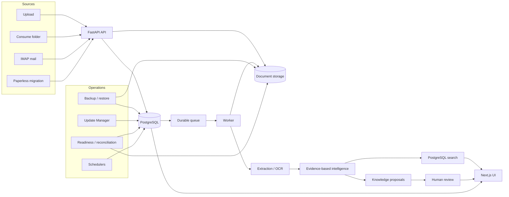
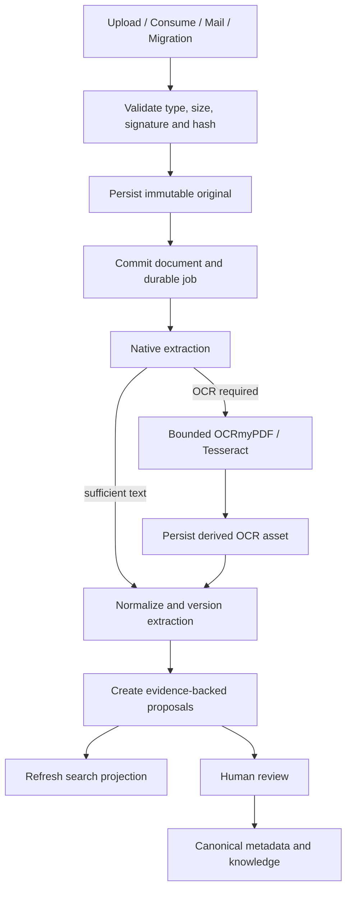
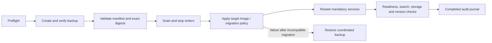

# PDI — Private Document Intelligence

> **Status: Project archived / feature development paused after v1.4.1.**
>
> PDI was developed as a complete local Document Intelligence platform and is retained as a technical reference and learning baseline. The software remains usable as released; no active milestone or feature-development schedule exists. Archiving the GitHub repository is a separate maintainer action.

PDI is a privacy-first, self-hosted platform that turns private PDF, JPEG, and PNG files into searchable, reviewable, document-backed knowledge. PostgreSQL remains the authoritative state store, original assets are immutable, and machine-derived metadata or knowledge becomes canonical only through explicit review.

The final release is [v1.4.1](https://github.com/maxsmolka/private-document-intelligence/releases/tag/v1.4.1), commit `4ecc77d5fe40d76bcced8dd3bba3a444ca83e4cc`, at Alembic schema `20260828_0020`.

## Architecture overview



The API, worker, backup scheduler, reminder scheduler, consume service, and mail service share one Python release image. All document-bearing services must use the same authoritative storage. The Next.js UI accesses protected API and document routes through its same-origin proxy. PDI is designed for a trusted private network or VPN behind an HTTPS reverse proxy, not direct Internet exposure.

The complete frozen architecture and ownership rules are documented in the [final architecture snapshot](docs/FINAL_ARCHITECTURE.md) and [architecture reference](docs/ARCHITECTURE.md).

## Core capabilities

- **Ingestion:** validated streaming upload, watched consume folders, optional IMAP, resumable Paperless migration, SHA-256 deduplication, and durable PostgreSQL jobs.
- **Immutable assets:** original files never change; derived OCR renditions are content-addressed, versioned, and reconciled against database records.
- **Extraction and OCR:** native PDF extraction plus bounded OCRmyPDF/Tesseract processing for scanned PDFs and images, with provider and version provenance.
- **Evidence-based intelligence:** deterministic extraction by default, optional local Ollama integration, confidence and exact evidence, and append-only decision history.
- **Search:** weighted German PostgreSQL full-text search, exact identifier boosts, structured filters and facets, deterministic pagination, and grounded page snippets.
- **Knowledge layer:** reviewed organizations, aliases, contracts, relationships, events, deadlines, actions, and timelines linked to document evidence.
- **Review workflows:** separate metadata, extraction-version, and knowledge decisions; machine proposals never silently overwrite canonical state.
- **Local UI and security:** authenticated responsive workspace, Admin/User/Read-only roles, CSRF protection, TOTP 2FA, recovery codes, session revocation, and scoped API tokens.
- **Operations:** readiness, storage reconciliation, open export, coordinated backup/restore, schedulers, and a constrained operator-controlled Update Manager.

## Document ingestion flow



OCR quality and downstream intelligence quality are measured separately. A better character transcription does not automatically imply better classification, entity extraction, or evidence quality.

## Deployment model

The release baseline uses Docker Compose with PostgreSQL 17, persistent document and backup volumes, an API, worker, two schedulers, web UI, and optional `consume` and `mail` profiles. The managed overlay pins every PDI service to immutable image digests so optional services cannot silently run a different version.

```bash
cp .env.release.example .env.release
# Replace every CHANGE_ME value and set the public HTTPS URL.
docker compose --env-file .env.release -f compose.release.yaml up -d
```

Open the configured HTTPS URL and complete `/setup`. Synology installations must also follow the [NAS deployment baseline](docs/NAS_DEPLOYMENT.md). Never expose Compose-expanded secrets in diagnostics, and never mount the Docker socket into the API or web containers.

For a development-only source checkout:

```bash
git clone https://github.com/maxsmolka/private-document-intelligence.git
cd private-document-intelligence
docker compose up --build -d
```

Open <http://localhost:3000>. Stop with `docker compose down`; adding `--volumes` permanently deletes the development database and uploaded documents.

## Controlled update flow



Updates remain explicit and operator-controlled. The release manifest binds the version, commit, immutable backend/web digests, schema boundary, backup requirement, reindex policy, architecture, and rollback mode. Automatic installation is not implemented.

## Backup, restore, and security

Database and document storage form one recovery unit. Create and verify a coordinated backup before upgrades, retain its manifest and checksums, and restore database and assets together when schema or storage compatibility requires it. See [Backup and restore](docs/BACKUP_RESTORE.md) and [Controlled updates](docs/UPDATES.md).

PDI keeps document processing local by default, exposes no public document URLs, sanitizes operational errors, and separates application containers from host-level update authority. Protect `.env.release`, the TOTP encryption key, database credentials, IMAP secret files, backups, exports, logs, and private topology. See the [security policy](SECURITY.md), [application security model](docs/SECURITY.md), and [repository security model](docs/REPOSITORY_SECURITY.md).

## Documentation index

- [Final architecture snapshot](docs/FINAL_ARCHITECTURE.md)
- [Lessons learned](docs/LESSONS_LEARNED.md)
- [Project transition](docs/PROJECT_TRANSITION.md)
- [Historical, unscheduled roadmap](docs/FUTURE_ROADMAP.md)
- [Ingestion sources](docs/INGESTION_SOURCES.md), [OCR/intelligence](docs/INTELLIGENCE.md), [search](docs/RETRIEVAL.md), and [knowledge](docs/KNOWLEDGE.md)
- [Operations](docs/OPERATIONS.md), [backup/restore](docs/BACKUP_RESTORE.md), [updates](docs/UPDATES.md), and [NAS deployment](docs/NAS_DEPLOYMENT.md)
- [Release process](docs/RELEASES.md) and [v1.4.1 release notes](docs/releases/v1.4.1.md)

PDI is released under the [MIT License](LICENSE). Never attach private documents, credentials, logs, backups, or deployment topology to public issues.
