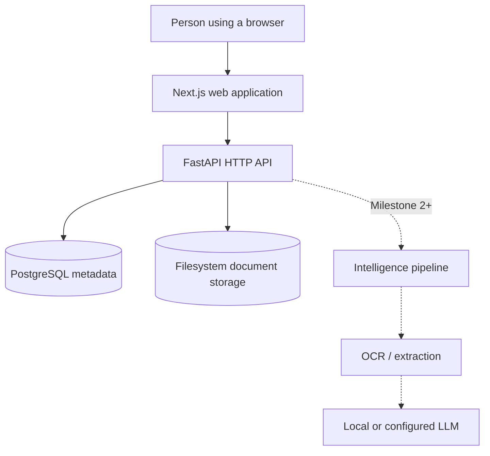

# Architecture

## Goals

PDI is a local-first document intelligence platform that remains responsive on a home server or NAS. Its foundation favors a few replaceable components, direct data flow, explicit schema evolution, and dependencies with an immediate purpose.

Milestone 1 proves one vertical slice: upload, durable file storage, metadata persistence, listing, detail retrieval, and preview.

## Non-goals

Milestone 1 does not include accounts, authentication, OCR, classifiers, LLMs, embeddings, vector storage, full-text search, background workers, or integrations. In particular, the `intelligence`, `search`, and `timeline` modules only mark future ownership boundaries; no hidden pipeline runs after upload.

## System context



The browser reaches the public API URL for uploads and previews. During server rendering, Next.js uses the internal Compose network URL. This keeps server traffic inside the deployment while preserving a URL reachable by the user's browser.

## Components

### API

FastAPI owns request validation and HTTP representation. Application functions in `pdi.documents.service` coordinate storage and SQLAlchemy operations. SQLAlchemy models are the initial domain/data model; a repository layer is deliberately absent because it would add indirection without another persistence implementation.

The upload path reads only a small signature prefix during validation, resets the stream, and then copies fixed-size chunks. SHA-256 and file size are calculated during that single pass. If metadata commit fails, the stored file is removed. A generated UUID-based key—not the submitted filename—selects the storage path.

### Web

Next.js App Router pages are Server Components by default. The document list and detail data access goes through `lib/api/documents.ts`. Client Components are limited to filters/search and the interactive upload dialog. Upload uses `XMLHttpRequest` because browser `fetch` does not expose useful upload progress.

### PostgreSQL

PostgreSQL stores document metadata and relationships added in later milestones. Files are never stored as database blobs. The initial table indexes `created_at`, `status`, `life_area`, and `sha256`; SHA-256 is intentionally non-unique because Milestone 1 records duplicates rather than deduplicating silently.

Alembic is the only schema creation/evolution mechanism in deployed environments. Application startup never calls `create_all`.

### Storage

`StorageBackend` describes the narrow operations the application needs: store a stream, resolve content, and delete. `LocalStorageBackend` confines keys to one configured root and finishes writes using a same-directory temporary file plus atomic rename. A future `S3StorageBackend` can implement the same behavior without changing routes or persistence models.

## API structure

- `/health/*` provides liveness and database-backed readiness.
- `/api/v1/documents` is the versioned document collection.
- Upload, list, detail, and content responses share typed Pydantic representations.
- Request middleware adds a request ID, safe response headers, and structured duration logs.

## Persistence and failure behavior

PostgreSQL and filesystem storage are not a distributed transaction. Milestone 1 minimizes inconsistency by writing the file first and deleting it if the database transaction fails. A process crash in that narrow interval can leave an orphan file. A future maintenance task can reconcile storage keys against the database; introducing a queue or transaction coordinator is not justified yet.

## Planned intelligence pipeline

Milestone 2 adds a persisted ingestion state machine behind an application service:

```text
upload → classify candidate → OCR/extract → metadata proposal → human review
```

Provider choices remain open. OCRmyPDF, Tesseract, and PaddleOCR should be evaluated with a representative private test corpus. Intelligence later sits behind an `IntelligenceProvider` boundary supporting local Ollama and optional OpenAI-compatible APIs. Search begins with PostgreSQL full-text search; pgvector is considered only after a semantic retrieval use case is measured.

