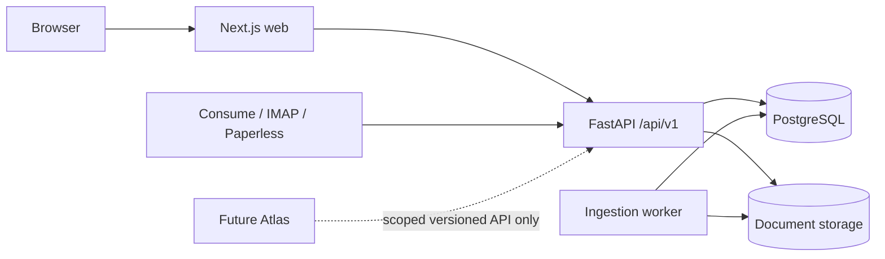
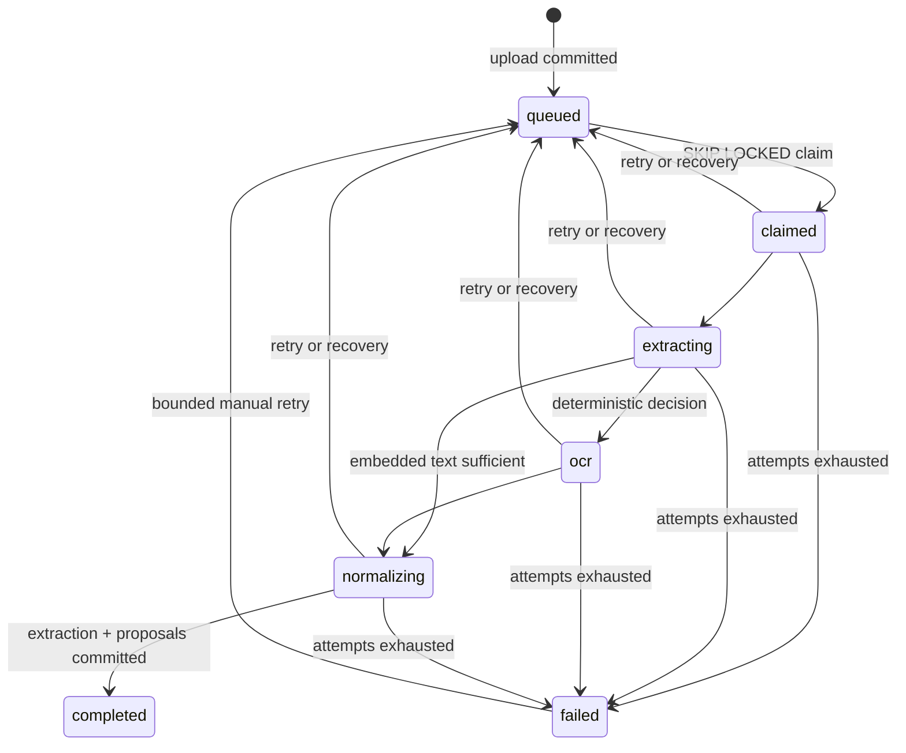
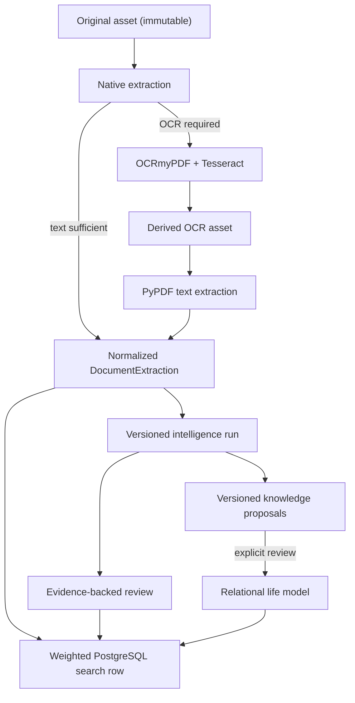

# Architecture

## Goals and boundaries

PDI is the authoritative, local-first system of record for documents, originals, extracted text, metadata, review state, search, and document lifecycle. It is designed for modest home-server and NAS hardware with direct data flow, explicit schema evolution, and replaceable components only where a concrete alternative exists.

Atlas Personal Intelligence is a future API consumer. Atlas may reason over PDI data and retain derived reasoning, but it must never read PDI's PostgreSQL database or storage volume. PDI-derived facts remain authoritative in PDI.

Semantic search, embeddings, Atlas implementation, notifications, and chat remain outside PDI. Milestone 6 adds authentication, read-only Paperless migration, external ingestion, coordinated recovery, open export, and operational readiness.

## System context

The API and worker use one immutable Python image with separate entrypoints. The API applies Alembic migrations before becoming healthy; the worker waits for API health during Compose startup, then operates independently.

Browser users authenticate with local database sessions, CSRF protection, and optional TOTP or recovery-code verification. Admin, user, and read-only roles are deliberately coarse; machine callers use digest-only scoped tokens. Security-sensitive actions append secret-free audit events. All upload, consume, mail, and migration entrypoints converge on shared file validation, storage, deduplication, and persistence; only ordinary new ingestion enters the existing extraction queue. Backup/restore coordinates PostgreSQL and storage through a transparent checksummed format. See [account security](ACCOUNT_SECURITY.md) and ADRs 0006–0009.

The web shell uses a fixed desktop navigation rail and a client-controlled narrow-layout drawer. Protected document delivery remains behind the same-origin Next.js proxy. PDF documents are fetched with the authenticated session and rendered locally with bundled PDF.js; the browser never receives a public storage URL and no remote rendering service is involved. Evidence links carry only a page number. Highlighting is withheld because extraction character offsets do not provide reliable PDF glyph coordinates.

## Ingestion lifecycle

`DocumentStatus` represents the user-facing lifecycle (`inbox`, `processing`, `needs_review`, `ready`, `archived`, `failed`). `IngestionJobState` represents worker execution. Valid transitions live in one testable state machine; every transition creates an `IngestionJobEvent` in the same transaction as the job change.

Upload streams to a same-directory `.part` file, calculates SHA-256, enforces the byte limit, and atomically renames to a UUID key. The API commits the document, original `DocumentAsset`, and queued job together. Original assets are immutable. OCR results use a content-addressed key and are promoted atomically before the active `ocr_pdf` asset record is committed. A crash can leave a recoverable orphan, which reconciliation reports.

## PostgreSQL queue

The queue is durable and contains no in-memory source of truth. Claiming orders by `available_at`, creation time, and UUID, and uses `SELECT … FOR UPDATE SKIP LOCKED`; concurrent PostgreSQL workers cannot claim the same row. Claims record identity, timestamps, heartbeat, attempts, and an audit event.

Failures retain a sanitized category/message. Attempts below the bound return to `queued` with explicit exponential delay; exhausted jobs become `failed`. On every poll, a worker reclaims active jobs whose heartbeat is older than `PDI_WORKER_JOB_TIMEOUT`. Extraction is idempotent at the database boundary because `document_extractions.document_id` is unique and retries update that record rather than append duplicates.

## Extraction and OCR

`ExtractionProvider` is deliberately small: support detection and asynchronous extraction. `ExtractionResult` includes normalized text, per-page text, page count, method, provider/version, warnings, language, and provider metadata. `DocumentExtraction` persists that provenance independently of document metadata.

PyPDF handles digital PDFs. Text is normalized with Unicode NFKC, CRLF/CR conversion, trailing-space removal, maximum two consecutive newlines, and outer whitespace removal. The deterministic heuristic measures total characters and useful/empty pages. Any page below 40 non-whitespace characters requests OCR, with an explainable reason such as `2_of_4_pages_without_usable_text`; this prevents mixed PDFs from silently losing scanned pages.

OCRmyPDF 14.0.1 with Tesseract 5.3.0 is the scanned-PDF default. It uses `--skip-text`, so native pages remain intact while scanned pages are OCRed; deskew and bounded-confidence rotation are enabled. The searchable PDF becomes a derived asset and its text is parsed through the same PyPDF normalization path. PNG/JPEG inputs use Tesseract directly and the same `DocumentExtraction` model.

## Proposals and review

Machine-derived proposals are stored in `metadata_proposals` with source, provider, confidence, structured value, exact evidence, run provenance, status, and confirmation time. They never overwrite canonical fields. Successful analyses are durable `IntelligenceRun` records keyed to an extraction ID and content hash. The review UI presents the original, extraction excerpt, warnings, canonical values, and pending proposals. Field decisions append canonical metadata history; final confirmation sets the document to `ready`. See [Document intelligence](INTELLIGENCE.md).

## Storage reconciliation

`pdi storage reconcile` compares originals and derived assets with storage. It reports orphan originals, orphan derived assets, missing originals/derived assets, and stale `.part` staging files. It is dry-run by default. Explicit cleanup deletes only orphan derived assets and stale staging files; recoverable originals and database records are never deleted.

## API and pagination

All consumer routes remain under `/api/v1`; health routes remain unversioned. Collection endpoints use zero-based `offset`, bounded `limit`, deterministic ordering, and a total count. UUIDs are opaque. Search adds a schema-versioned result envelope while preserving all earlier contracts.

## Retrieval

`search_documents` is an explicit, content-hashed projection of approved canonical fields and normalized extraction text. The API and worker update it synchronously inside source transactions; migration backfill and idempotent rebuild cover existing data and maintenance. PostgreSQL uses German weighted vectors, GIN retrieval, and an exact accepted-identifier expression index. Ranking combines `ts_rank_cd` with four documented exact-field boosts. Snippets are bounded slices of persisted page text with structured highlight ranges. See [Retrieval](RETRIEVAL.md), [benchmark](RETRIEVAL_BENCHMARK.md), and [ADR 0003](adr/0003-postgresql-fts-baseline.md).

Document text is versioned. `document_extractions` stores immutable provider outputs and source
provenance; `documents.canonical_extraction_id` explicitly selects the zero-or-one version used by
search, review, intelligence, and new knowledge analysis. Newer extractions never become canonical
implicitly. Deterministic comparisons record coverage, similarity, page metrics, and critical-field
preservation. Promotion is transactional, audited in `extraction_promotions`, refreshes search, and
marks re-analysis as required without rewriting historical evidence or accepted knowledge.

## Document knowledge

Completed intelligence runs feed a shared deterministic proposal stage. Canonical organizations, contracts, document relationships, events, deadlines, and actions exist only after evidence-gated review. Explicit relational tables and foreign keys keep provenance and common navigation straightforward; append-only history records decisions and state changes. Exact alias resolution may suggest a link, but only an explicit merge can consolidate organizations. Accepted organization/contract values and merge results refresh the M4 search projection in the same transaction. See [Document knowledge](KNOWLEDGE.md), [benchmark](KNOWLEDGE_BENCHMARK.md), and [ADR 0004](adr/0004-relational-review-first-knowledge.md).

## Future direction

Chat, embeddings, notifications, richer entity types, and Atlas integration remain future work; Atlas continues to consume only stable HTTP APIs.
