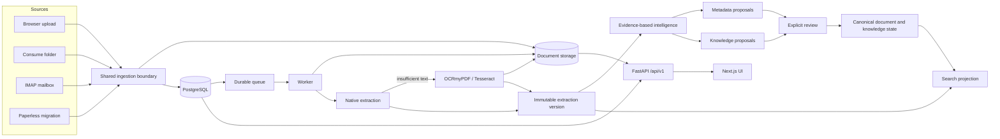
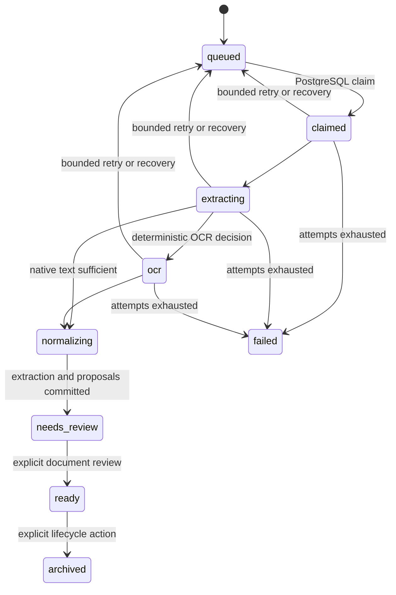
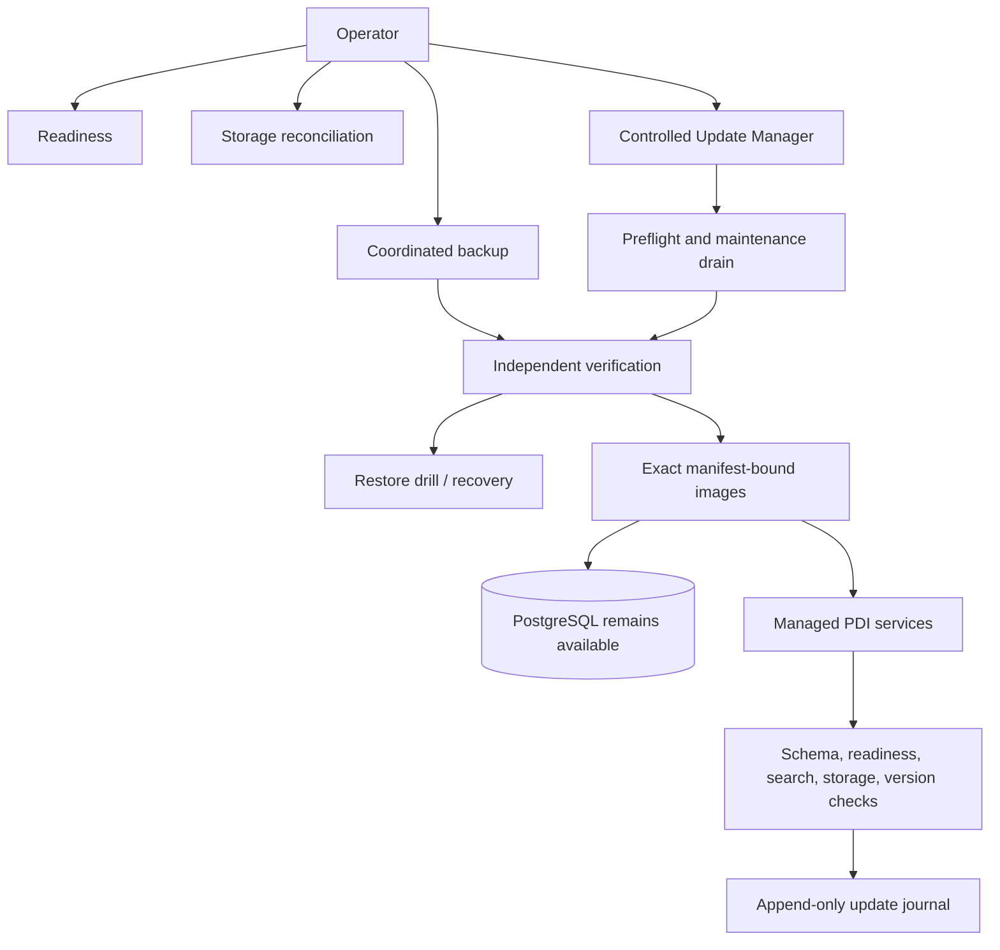

# Final architecture snapshot

## Status and scope

This snapshot freezes the PDI architecture at release v1.4.1, commit `4ecc77d5fe40d76bcced8dd3bba3a444ca83e4cc`, and schema `20260828_0020`. Feature development is paused and there is no active milestone. This document records the implemented system; it is not a future-work plan.

PDI is a standalone local Document Intelligence platform. PostgreSQL is authoritative for identity, documents, jobs, extraction provenance, canonical metadata, review state, search projections, knowledge, operations, and update journals. Document storage is authoritative for immutable originals and registered derived assets. Neither can be recovered correctly in isolation from the other.

## End-to-end data flow

All ingestion paths converge before storage and persistence. Consume and worker must use the same authoritative document-storage mount. A consume handoff into `processed` records source acceptance; it does not mean worker extraction or OCR has completed.

## Component ownership

| Component | Implemented responsibility | Authoritative state |
| --- | --- | --- |
| Next.js web | Authenticated documents, search, review, knowledge, timeline, settings, and update UI | None; server state is read from the API |
| FastAPI API | Validation, authentication, domain transactions, review, query APIs, operational preparation | PostgreSQL transactions and storage registration |
| PostgreSQL 17 | Users, sessions, documents, jobs/events, extractions, proposals, canonical state, search, knowledge, audit, backups, updates | All structured state |
| Document storage | Immutable originals and registered derived renditions | Asset bytes addressed by database records |
| Worker | Queue claim, extraction, OCR, intelligence, retry/recovery, search refresh | PostgreSQL job state; storage assets |
| Consume / mail | Optional external source polling and convergence on shared ingestion | Source checkpoints in PostgreSQL |
| Backup scheduler | Coordinated backup creation and verification | Backup records plus protected backup files |
| Reminder scheduler | Durable in-app deadline reminder processing | PostgreSQL reminder state |
| Host update executor | Exact-image deployment under a constrained service allowlist | Update journal in PostgreSQL and managed Compose overlay |

API, worker, both schedulers, consume, and mail use the same immutable backend release digest. Optional Compose profiles remain opt-in, but their image pins are not optional; this prevents hidden version drift when a profile is started later.

## Processing and review boundaries

Original assets never change. Extraction outputs are immutable versions; `canonical_extraction_id` selects the version used by search and new analysis. Intelligence proposals carry provider identity, confidence, evidence, and run provenance. Metadata and knowledge become canonical only after an explicit review decision. Search contains persisted canonical fields plus canonical extraction text and can be rebuilt deterministically.

## Operations plane

The API and web containers do not receive the Docker socket. Update preparation occurs in the application; mutation occurs through an operator-controlled host helper. PostgreSQL is not stopped by the executor. Backup and restore are part of the release model, not an afterthought.

## Deployment and security invariants

- Deploy behind HTTPS on a trusted private network or VPN; expose only the web endpoint.
- Keep PostgreSQL, API, storage, backups, update helper, and optional-source credentials private.
- Apply the managed image overlay last and pin exact digests for all seven PDI application services.
- Use one authoritative document-storage mount for every service that reads or writes document assets.
- Treat `docker compose config` output as sensitive because variable interpolation can expand secrets.
- Never publish private documents, OCR text, logs, hostnames, addresses, URLs, paths, backups, or production topology.
- Use only synthetic or fully redacted fixtures for tests and release qualification.
- Treat synthetic UAT as strong release evidence, not a substitute for operator verification in a real deployment.

## Frozen external boundaries

Atlas integration is not implemented or scheduled from PDI. If another project consumes PDI in the future, it must use revocable, scoped, versioned HTTP APIs and preserve PDI UUID/page provenance; it must never read PDI tables or storage directly.

Compute Core remains external and unimplemented. The documented executor seam is only an architectural decision gate; PostgreSQL task state remains authoritative. PP-OCRv6 Medium is only a documented possible future evaluation and is not a dependency or selected provider.
